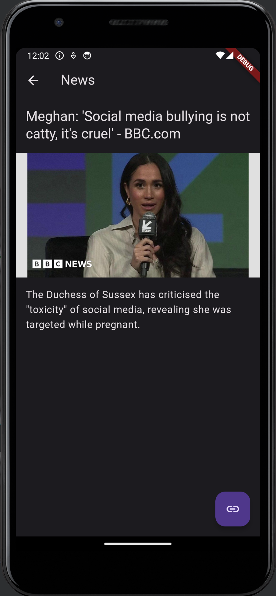

# Flutter News App

This project is a Flutter application that displays news articles in a scrollable list. The app comes with a dark theme enabled by default, providing an elegant and battery-saving interface for reading news articles.

## Features

- **Dark Theme**: A user-friendly interface with a dark color scheme to reduce eye strain in low-light conditions.
- **Scrollable News List**: An easy-to-navigate interface where users can scroll through the latest news articles.
- **Elegant Design**: With the use of Material Design and a custom font, the app offers an aesthetically pleasing experience.

## Getting Started

To get a local copy up and running, follow these simple steps.

### Prerequisites

Ensure you have Flutter installed on your machine. To install Flutter, visit the [Flutter website](https://flutter.dev/get-started/) and follow the installation instructions for your operating system.

### Installation

1. Clone the repo
   ```sh
   git clone https://github.com/your_username_/Project-Name.git
    ```

2. Install the required packages
   ```sh
   flutter pub get
   ```
   
3. Run the app
   ```sh
   flutter run
   ```


### License
Apache License 2.0 (Apache-2.0), commercial and non-commercial use allowed.

### Screenshots



### Contributing
Branch clean code contains the app, focused on clean code and best practices, but it's not finished yet.
